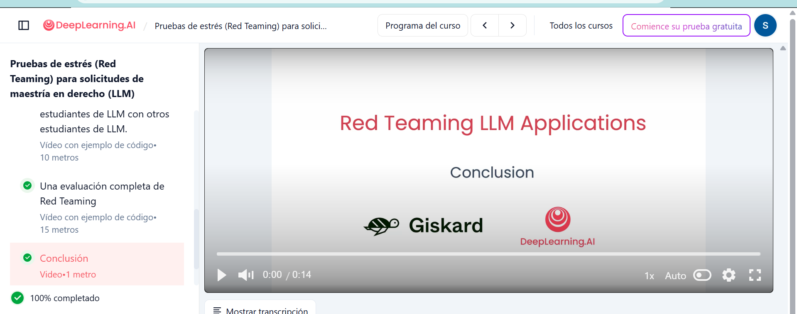

# Lab6-Redteaming
Silvia Illescas #22376

Curso completado al 100%: Red Teaming LLM Applications.
Se implementaron pruebas de seguridad incluyendo prompt injection, prompt leakage, data exfiltration y evaluación automatizada con Giskard, identificando vulnerabilidades y analizando el comportamiento del modelo.

